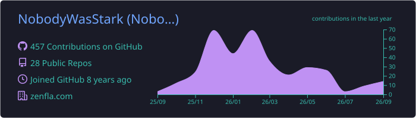
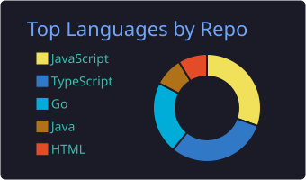
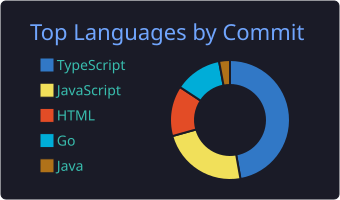
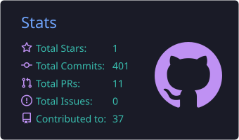

<div align="center">


<br/>

<a href="https://www.linkedin.com/in/rifate-nur-shawn-5a6607275/"></a>
<a href="https://github.com/NobodyWasStark"></a>


<br/><br/>


</div>

<br/>


## 🧭 About Me

```yaml
name: Rifate Nur Shawn
role: Full-Stack Software Engineer
education: CSE @ United International University, Dhaka (Class of 2027)
location: Dhaka, Bangladesh
focus: [full-stack web, backend systems, agentic AI workflows, self-hosted LLM infra]
philosophy: "minimal-complexity, terminal-first, AI as force multiplier — not a crutch"
currently:
  - Freelancing on production SaaS builds
  - Running a self-hosted LLM inference stack for agentic coding
```

<br/>

## 🚀 Featured Work

<table width="100%">
<tr>
<td width="33%" valign="top">
<h3>🏗️ UrbAssist</h3>
<p>French urban-planning SaaS automating building permit prep.</p>
<p><code>Next.js</code> <code>Prisma</code> <code>Gemini</code> <code>Stripe</code> <code>Fabric.js</code> <code>R3F</code> <code>jsPDF</code></p>
<p>Portfolio centerpiece for freelance work.</p>
</td>
<td width="33%" valign="top">
<h3>💼 FreelanceHub</h3>
<p>Full-stack freelance marketplace app, hardened through iterative multi-phase audits.</p>
<p><code>Node.js</code> <code>TypeScript</code> <code>Prisma</code> <code>PostgreSQL</code> <code>Socket.io</code></p>
<p>Auth migration, query optimization, error handling overhaul.</p>
</td>
<td width="33%" valign="top">
<h3>🖥️ Stark</h3>
<p>Self-hosted home server running a local LLM inference stack for agentic coding.</p>
<p><code>Linux</code> <code>Local LLMs</code> <code>Agentic tooling</code></p>
<p>Solo, single-machine, terminal-first infra.</p>
</td>
</tr>
</table>

<br/>


## 🛠️ Tech Stack

<div align="center">

<h4>Languages</h4>
<br/><br/>

<h4>Frontend</h4>
<br/><br/>

<h4>Backend & Data</h4>
<br/><br/>

<h4>Infra & Tools</h4>


</div>

<br/>


## 📊 GitHub Analytics

<div align="center">
  
</div>

<br/>

<div align="center">


</div>

<div align="center">

</div>

<br/>

<div align="center">
<table>
<tr>
<td></td>
<td></td>
<td></td>
</tr>
</table>
</div>

<br/>

<div align="center">

<h3>📈 Contribution Graph</h3>


</div>

<br/>

<div align="center">

<h3>🏆 Trophies</h3>


</div>

<br/>


<div align="center">

<h2>🐍 Contribution Snake</h2>


<sub><i>generated via the <a href="https://github.com/Platane/snk">snake action</a> — set up as a scheduled workflow</i></sub>

</div>

<br/>

## ✍️ Dev Quote

<p align="center">

</p>

<br/>

<div align="center">

<h3>🤝 Open to freelance work, collaboration, and hard problems</h3>


</div>
